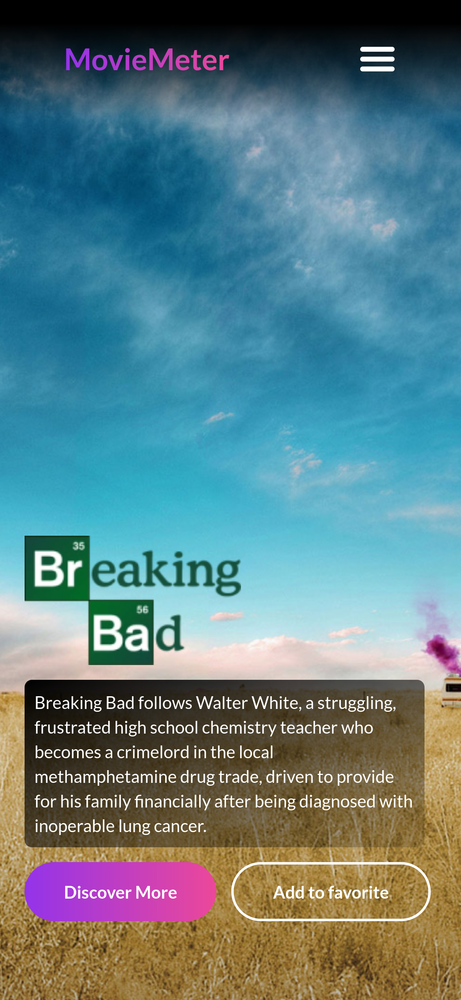

# Movies/Series Website

A simple web application to search and display information about movies and series. Built with React, styled with TailwindCSS, and using the OMDb (Open Movie Database) API to fetch movie and series data.

## Features

- Display detailed information about movies and series
- Responsive design

## Technologies Used

- [React](https://reactjs.org/)
- [TailwindCSS](https://tailwindcss.com/)
- [OMDb API](http://www.omdbapi.com/)

## Getting Started

### Prerequisites

- [Node.js](https://nodejs.org/)
- [npm](https://www.npmjs.com/) or [yarn](https://yarnpkg.com/)

### Installation

1. Clone the repository:

    ```bash
    git clone https://github.com/ismaildrs/movie-meter.git
    cd movies-meter
    ```

2. Install dependencies:

    ```bash
    npm install
    # or
    yarn install
    ```

3. Set up your environment variables:

    Create a `.env` file in the root of your project and add your OMDb API key:

    ```plaintext
    VITE_OMDB_API_KEY=your_api_key_here
    ```

### Running the Application

Start the development server:

```bash
npm run dev
# or
yarn run dev
```

The application will be available at `http://localhost:5173/`.

## Images

### PC version


### Mobile version




